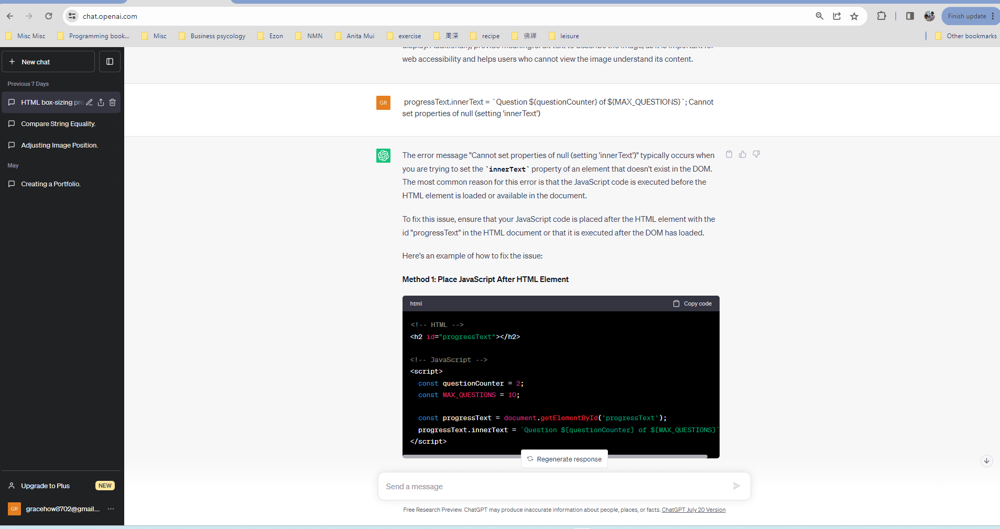

# Quiz Game

Developer: Grace

This website is a quiz game website where the user matches the capital city to the country.

To view the website, click [here](https://www.example.com).

## Table of Contents

1. User Experience (UX)
   
   - Initial Discussion
   - User Stories
   - Typography
   - Wireframes

2.	Design
    -   Typography
    -   Wireframes
    -   Features
        -   Button Bar
        -   Footer
        -   Main Page Ethos Section
        -   Game Page
        -   Score Page
        -   Highscores Page
        -   Modal Page

    -   Technologies Used
    -   Languages Used
    -   Frameworks, Libraries & Programs Used

3.	Testing
  
     - W3C Validator
     - Accessibility
     - Home Page
     - Menu Page
     - Gallery Page
     - Contact Us Page
     - Sign Up Page
     - Tools Testing
     - General Testing

4.	Finish Products
     - Home Page
     - Menu Page
     - Gallery Page
     - Contact Us Page
     - Sign Up Page

5.	Deployment
     - GitHub Pages

6.	Credits
     - Content
     - Code
     - Acknowledgments

***

## User Experience (UX)

### Initial Discussion
To play the game, the user must press the play game button to go to the game page.  The user has ten quiz questions to match the capital city to the country.  The scores are shown at the right top of the screen and at the left top you can see the progression of the question answer.  When all the questions are answered, it will come to the end page where the users have to key in their name and press the save button.

### User stories
  - Users can view the site on different devices e.g., desktop, tablet, and smartphone.
  - This quiz game is educational.
  - Users can learn about the capital city for the country.

[Back to Table of Contents](#table-of-contents)

## Design

### Typography

[Google Fonts](https://fonts.google.com/) was used for the websites.
    - The body used cursive fonts and 'Segoe UI', Tahoma, Geneva, Verdana, sans-serif
      as a fallback font.

### Wireframes

[Balsamiq](https://balsamiq.com/) has been used to create wireframes for the website.

[Back to Table of Contents](#table-of-contents)

### Features

There are four pages in this website which the users can browse through each using the buttons.

-   From the main page to the game page and highscores page.
-   From the score page to the highscores page.
-   From the highscores page back to the main page.

#### Button Bar

-	Button are used to navigate here.  
-   Users must pressed the 'Play Game' button to go to Quiz question page.  
-   Users must pressed 'HighScores' button to checked high scores.  
-	At score page, there are 'Save', 'Play Again' and 'Go Home' button.
-	At scores board page, there are 'Clear High Scores' button and also 'Go Home' button.

#### Footer

-	The footer comprised of copyright statement and social media links.
-	The social media links is for users to keep in connected and keep up to date with any activities.

#### Main page ethos section

-	This section consists of Play Game button for user to start the game.
-	Also have High Scores button for user to checked scores.

#### Game page

-	The Question progression bar at the top right show how many questions are answers out of the total ten question.
-	The score at the left top show the numbers of scores win.
-	The ethos-section of game page show the quiz question and below are three choice of answers choose to from.

#### Score page

-	In this page, it shows the scores that you achieve.
-	Users have to key in their name to save their score.
	
#### Highscores page

-	In this page, it shows the list of name who achived high scores.
-	Users can press the button 'Clear High Scores' to clear scores or press the 'Go Home' button to go to the main page.

#### Modal page

-   When the user click the button 'Play Game' they will redirect to this page.
-   In this page it explain about the quiz game.
-   When user click at the 'cross' button or outside of the block, it will close the modal page and redirect user back to the main page.
-   When the  user click on the 'Play' button, it will redirect the user to the game page.

### Technologies Used

-	Languages Used
	- HTML , CSS and Javascript.

### Frameworks, Libraries and Programs Used

-	Balsamiq is used to create wireframes.
-	Github is used to save and store the files for the website.
-	Codeanywhere was used for writing code, committing and then push to GitHub.
-	Am I Responsive is used to test the responsiveness of the website when used in the desktop, tablets, and mobile devices.
-	Chrome DevTools is used to support the coding process and test the website’s responsiveness during coding. 

-	Font Awesome was used to add the crown icons in the 'High Scores' button.
-	W3C Markup Validation Service was used to validate the HTML codes.
-	W3C CSS Validation Service was used to validate the CSS codes.
-   JSHint was used to validate the JavaScript codes.
-   Chat gpt has used in help solved some coding problems.

## Testing

### Validator Testing

-   W3C Validation Service was used to validate the codes for errors.
-   W3C Markup Validation Service  was used to validate the HTML codes.
-   W3C CSS Validation Service was used to validate the CSS codes.
-   JSHint was used to validate the JavaScript codes.

#### Main Page Validation

-   No errors or warnings show.

#### Game validation

-   Two error found.
-   Problems solve by adding missing closing tags.

-   Missing semicolon warning found solved by add semicolon.
-   "['numbers] is better written in dot notation" are ignored.

#### End page validation

-   No error or warning found for html and Javascript codes.

#### Highscores Page validation

-   No error or warning found for html and css codes.
-   JSHint found one undefined variable, solved by adding the variable in line 4.

#### Modal Page validation

-   There is an error where I have ignore as I would want to link the button to the game page.

-   No error found in CSS.

-   There are 3 error in modal.js, after checking at ChatGpt it's about the  ECMAScript version not supported.
-   After changing the 'const' to 'var', the error are solved. 

### Lighthouse

-   Lighthouse test for accessible performance for Main page, Game page, End page and Highscores page, both for mobile and desktop performances.

 
### Tools Testing
-	Chrome DevTools was used to test and modify HTML elements , CSS  and Javascript styles in the project.
-   Am I Responsive is used to test the responsiveness of the website when used in the desktop, tablets, and mobile devices. - -   Browser Compatibility Google Chrome - No appearance, responsiveness nor functionality issues.
-   Microsoft Edge - No appearance, responsiveness nor functionality issues. 
-   Modzilla Fox - No appearance, responsiveness nor functionality issues.

### General Testing
-   Button Links
    -   Test each button links and worked as expected.
    -   Test each social media links and opened as expected in a new tab for external link.
	

[Back to Table of Contents](#table-of-contents)

## Finish Products

### Main Page Site

### Game Page Site

### End Page Site

### Highscores Page Site

### Modal Page Site

## Deployment

-	This website was develop using Visual Studio Code from Codeanywhere then committed and push to GitHub.
-	GitHub Pages
    -   Steps to deploy this website to GitHub Pages from its GitHub repository:
        1.  Sign in to the GitHub site.
        2.  Choose the repository intended to deploy.
        3.  Go to setting.
        4.  Click on the ‘Page’ at the side menu.
        5.  Go to Build and deployment.
        6.  At Source select ‘Deploy from a branch’
        7.  At the Branch, select ‘main’, ‘/(root)’ and click save.
        8.  Go to GitHub Pages at the top.
        9.  Your site is live at [here](https://grace-ghb.github.io/quiz-game/)
        10. Click on ‘Visit site’ and it will bring you to the new tab of your website.

## Credits

### Content

All content written by the developer.

-	colormind.io
        -   Is used to generate color pallette to make comparison
-   Font Awesome was used to add icons.
        -   Icons for social media links at the footer for Facebook ,  Instagram, Twitter and WeChat.
        -   Icons crown for highscores..
	
### Code

Codes were consulted regularly for better understanding and knowledge from the website:

[Stackoverflow](https://stackoverflow.com/)

[W3Schools](https://www.w3schools.com/)

[Tutorials Point](https://www.tutorialspoint.com/)

[Modzilla Developer](https://developer.mozilla.org/)

[FreeCodeCamp](https://freecodecamp.org/)

[Love Maths](https://github.com/Code-Institute-Solutions/love-maths-2.0-sourcecode/tree/master/05-tidying-up/01-a-few-last-things)

[Chat Gpt](https://chat.openai.com/)

[YouYube from Brian Design](https://www.youtube.com/watch?v=f4fB9Xg2JEY&t=2190s)

## Acknowledgements

-	My husband for his support and understanding.
-	My mentor, Marcel, for his invaluable feedback and guidance especially on how to write a proper commit message.
-	Code Institute and the Slack Community for their support, encouragement, and sharing of knowledge make it possible for me work on the project.

[Back to Table of Contents](#table-of-contents)